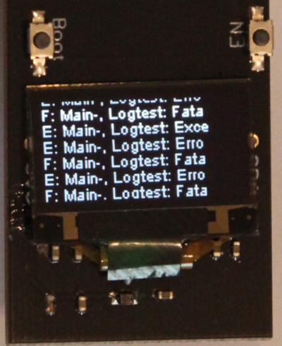

# Library DisplayLoggerTarget

## Ziele

Wird ein DisplayLoggerTarget beim Logger registriert, werden Logausgaben, die zumindest dem registrierten LogLevel entsprechen auf dem OLED-Display des ESP ausgegeben.
Damit eine zeilenweise Ausgabe auf dem kleinen Display sinnvoll ist, werden die Ausgabetexte (LogLevel, Tag, Message) entsprechend gekürzt. Bei der Verwendung ist daher darauf zu achten, beim Tag und bei der Message Texte ohne langen Präfix zu verwenden, damit die Ausgabe Sinn ergibt.

## Hardware

Es wird ein ESP mit einem OLED-Display benötigt.

## Software

### Abhängigkeiten

- Display kapselt den Zugriff auf das OLED-Display

### Testanwendung am ESP

In einer Endlosschleife wird alle 5 Sekunden für jeden LogLevel eine Ausgabe erzeugt.
Der LogLevel wird je Durchlauf erhöht. Daher kommen je Durchlauf weniger Meldungen beim Target (OLED) an.
Nachdem der LogLevel FatalError erreicht wurde, wird wieder von vorne begonnen.

#### UI

Serieller Monitor

````
DisplayLoggerTargetTest
=======================
************ Setted LogLevel: Info *************
I: Main-, Logtest: Info
D: Main-, Logtest: Debu
E: Main-, Logtest: Exce
E: Main-, Logtest: Erro
F: Main-, Logtest: Fata
************ Setted LogLevel: Debug *************
D: Main-, Logtest: Debu
E: Main-, Logtest: Exce
E: Main-, Logtest: Erro
F: Main-, Logtest: Fata
************ Setted LogLevel: Exception *************
E: Main-, Logtest: Exce
E: Main-, Logtest: Erro
F: Main-, Logtest: Fata
````

OLED-Display:



#### Testprogramm

````c
#include <Arduino.h>
#include <Logger.h>
#include <DisplayLoggerTarget.h>
#include <Display.h>

void setup() {
    Serial.begin(115200);
    Display.init(ANIMATION_NONE, true, TO_LONG_BEHAVIOUR_NEWLINE);
    LoggerTarget* loggerTarget = new DisplayLoggerTarget("displaylogger", 0);
    // Logger.init("test");
    Logger.addLoggerTarget(loggerTarget);
    Serial.println();
    Serial.println("=======================");
    Serial.println("DisplayLoggerTargetTest");
    Serial.println("=======================");
}

void loop() {
    LoggerTarget* loggerTarget = Logger.getLoggerTarget("displaylogger");
    int logLevel = loggerTarget->getLogLevel();
    Serial.printf("************ Setted LogLevel: %s *************\n", Logger.getLogLevelText(logLevel));
    Logger.info("Main-Loop", "Logtest: Info");
    Logger.debug("Main-Loop", "Logtest: Debug");
    Logger.exception("Main-Loop", "Logtest: Exception");
    Logger.error("Main-Loop", "Logtest: Error");
    Logger.fatalerror("Main-Loop", "Logtest: Fatalerror");
    if(logLevel == LOG_LEVEL_NOLOG){
        logLevel = LOG_LEVEL_INFO;
        loggerTarget->setLogLevel(logLevel);
        Serial.println("__________________________________________________");
    } else {
        logLevel++;
        loggerTarget->setLogLevel(logLevel);
    }
    delay(5000);
}
````

## Library

````c
#pragma once

#include <LoggerTarget.h>

class DisplayLoggerTarget : public LoggerTarget
{
    public:
        DisplayLoggerTarget(const char* loggerName, int logLevel);
        virtual void log(const char* logLevelText, const char* tag, const char* message);
        
    private:
};
````


