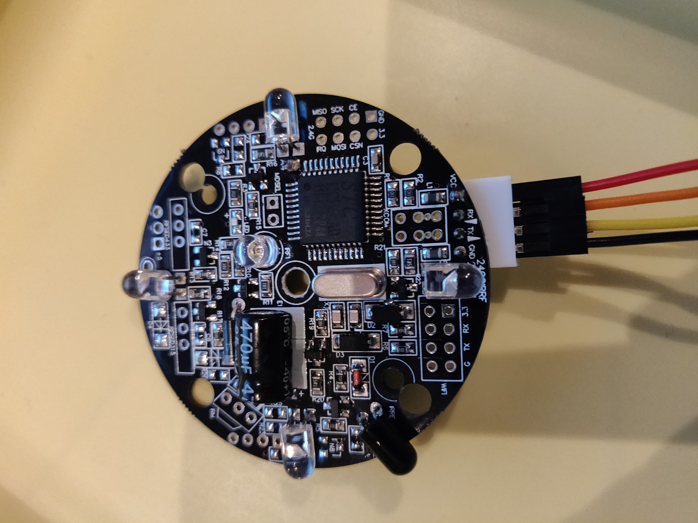
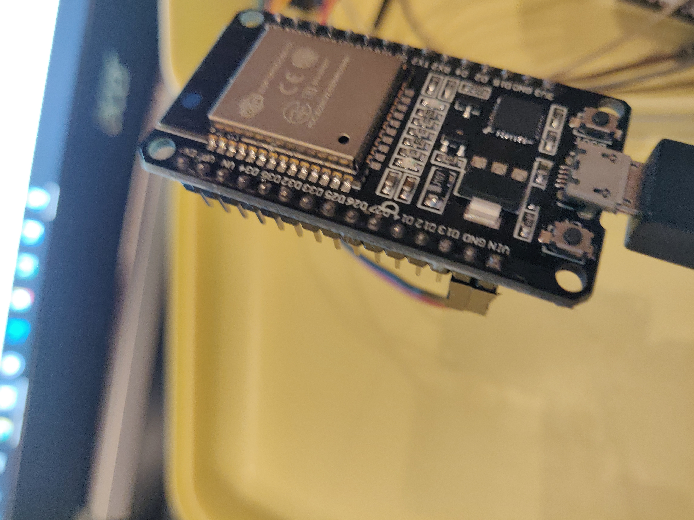

# Library IrdaModule

## Ziele

Der ESP soll mit Hilfe dieser Libary Infrarot-Signale senden und lesen können.
Dieser Libary blockiert nicht den ESP dadurch gibt es keine Wartezeiten.

Diese Libary ist von der Libary Actor abhängig.

## Hardware

Es wird lediglich ein ESP32 und ein IrDevkit Sensor benötigt.

### Anschluss

IrdaModule -> ESP32:

* VCC -> VIN
* GRD -> GRD
* RX -> 19
* TX -> 18





## Software

### Beispielaufrufe

```c
#include <Arduino.h>
#include <IrdaModule.h>

#define  HARDWARESERIALNUMBER 2

int txPin= 19;
int rxPin= 18;

IrdaModule irdaModule(rxPin,txPin,"esp","irdaModule");

void setup() {
  Serial.begin(115200);
  
  Serial.println("IrdaModule-Test");
  Serial.println("===============");

}
 
void loop() {
  
    irdaModule.setActorTo(1);
    delay(5000);
    irdaModule.setActorTo(0);
    delay(5000);
}


```

### Erklärung

* ```IrdaModule(int rxPin, int txPin, const char *thingName, const char *name)``` Muss als erstes aufgerufen werden. Darin werden die Pins festgelegt. 

### Library

##### Methoden

| ```IrdaModule::``` | Erklärung |
|-|-|
|```IrdaModule(int rxPin, int txPin, const char *thingName, const char *name)```| Setzt die Pins beim IrdaModule. |
|```void send_ir_signal(const char* irCodedefault)``` | Sendet ein Infrarot-Signal  |
|```void read_ir_signal()``` | Gibt den Infrarot-Code aus |
|```void start_learning_mode()``` | ließt ein Infrarot-Signal |
|```virtual void setActorTo(float value)``` | Holt sich den richtigen IrCode von ThingConfig und gibt es dann an send_ir_signal weiter |
|```virtual float readStateFromActor()``` | Gibt den aktuellen Wert des Actors(IrdaModule) zurück. (ein/aus) |
