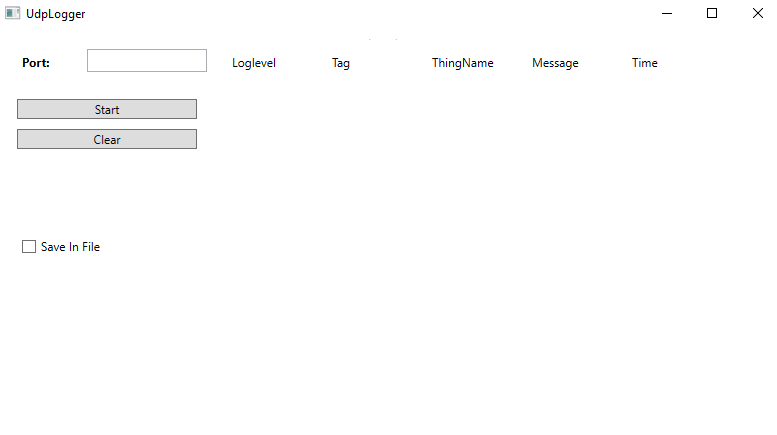
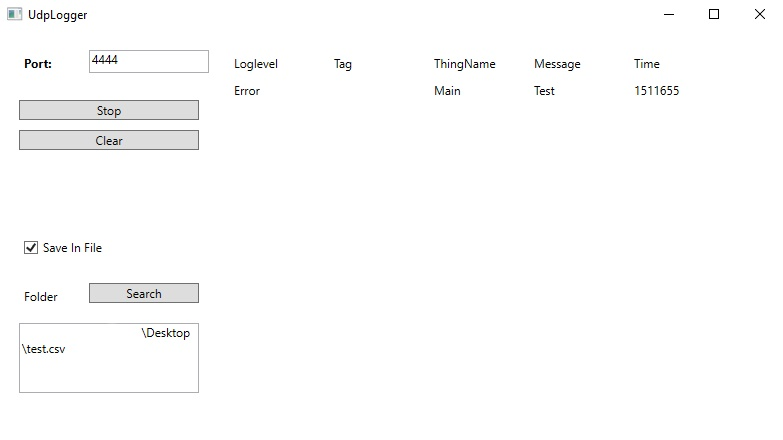

# Library UdpLoggerTarget

## Allgemeines

Mit Hilfe dieser Klassekönnen Logmeldungen über UDP versendet werden.
Ohne Konfiguration wird als Empfängeradresse die Broadcastadresse des aktuellen IP-Segments (z.B. 192.168.0.255) verwendet. Der Standardport ist 49155. Sowohl die IP-Adresse als auch der Port können über ThingConfig angepasst werden.

Die IP und der Port muss bei ThingConfig unter diesen Keys gespeichert werden. 
Key | Value
--- | ---
`udploggerip` | `192.168.1.1`
`udploggerport` | `4444`


## Software

### Abhängigkeiten

- LoggerTarget (BasisVerhalten wird geerbt)
- ThingConfig (IP-Adresse und Portnummer konfigurieren)

### Test des UDP-Logger-Targets

Neben der Log-Quelle (Testprogramm UdpLoggerTest am ESP) wird auch ein Empfänger für die Lognachrichten benötigt. Dazu gibt es ein eigenes Windows-Programm WinLogViewer, welches die Lognachrichten empfängt, auf das Filesystem in eine CSV-Datei persistiert und Such- und Filtermöglichkeiten bietet.

#### WinLogViewer


Die Klasse UDPLoggerTarget wird mit dem Tool UdpLoggerClient getestet.
Dabei wird die IP-Adresse des Ziel Computers benötigt wie auch der Port. Dieser müssen in ThingConfig vorhanden sein sonst wird die Brodcast IP genommen und der Port 49155. 


Dabei wird die Zeit in Unixtime angezeigt.


#### Library


#### Headerdatei UdpLoggerTarget.h

````c
class UdpLoggerTarget : public LoggerTarget
{
    public:
        /**
         * Udp-Logmeldungen werden standardmäßig an Broadcast-IP-Addresse (z.B. 10.0.0.255)
         * und an Portnummer 49155 gesendet.
         * Über ThingConfig kann sowohl die Ip-Adresse (udploggerip) als
         * auch die Portnunmmer (udploggerport) konfiguriert werden.
         */
        UdpLoggerTarget(const char* name, int logLevel);
        
        /**
         * Die Logmeldung wird per UDP verschickt
        */
        virtual void log(const char* logLevelText, const char* tag, const char* message);
        
    private:
        WiFiUDP _udp;
        IPAddress _ip;
        int _port;
};
````

### Beispiel für einen konkreten UdpLoggerTarget

````c
void setup() {
	Serial.println(F("*UTT Test fuer UDP-Loggertarget"));
	Serial.println(F("*UTT =========================="));
	ThingConfig.readConfig();			// Einlesen der Konfiguration in den JSON-Cache
	InternLed.init(LED_BUILTIN_PIN);
	HttpServer.init();					// HttpServer initialisieren
	ThingTime.setNtpTimeSubscriber();   // Zeit über Internet synchronisieren	

	UdpLoggerTarget* udpLoggerTarget=new UdpLoggerTarget("udplogger", 0);
    Logger.addLoggerTarget(udpLoggerTarget);

}

long lastUdpSentTime = millis();

void sendUdpLogMessages(){
  	LoggerTarget* udpLoggerTarget = Logger.getLoggerTarget("udplogger");
	int logLevel = udpLoggerTarget->getLogLevel();
  	Serial.printf("Actual minimum Loglevel set: %s\n", Logger.getLogLevelText(logLevel));
	Logger.info("Main-Loop", "Info");
	Logger.debug("Main-Loop", "Debug");
	Logger.exception("Main-Loop", "Exception");
	Logger.error("Main-Loop", "Error");
	Logger.fatalerror("Main-Loop", "FatalError");
	if(logLevel == LOG_LEVEL_NOLOG){
		logLevel = LOG_LEVEL_INFO;
		udpLoggerTarget->setLogLevel(logLevel);
		Serial.println("-----------------------------------------------------------------------");
	} else {
		logLevel++;
		udpLoggerTarget->setLogLevel(logLevel);
		Serial.println();
	}
}

void loop() {
	HttpServer.handleClient();
	if( millis() - lastUdpSentTime > 3000){
		sendUdpLogMessages();
		lastUdpSentTime = millis();
	}
	delay(1);
}
````
