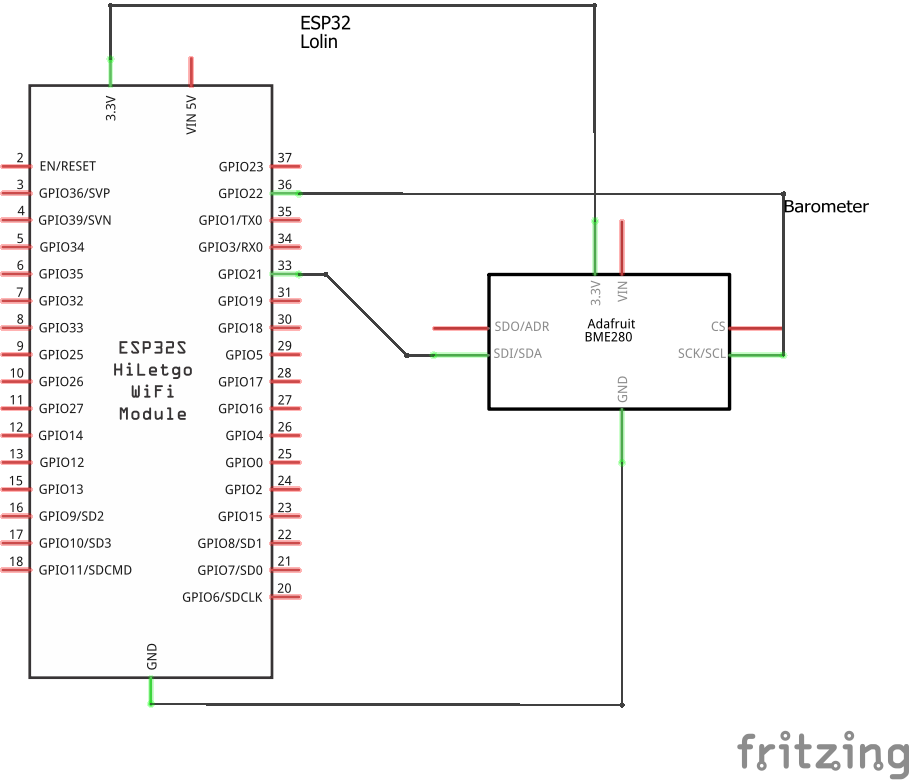

# Library Adafruit_BME280

## Ziele

Der BME280 ist ein kombinierter Temperatur-, Luftfeuchte- und Luftdrucksensor mit I2C-Schnittstelle.
Als Basislibrary wird eine entsprechende Adafruit-Bibliothek verwendet.

## Hardware

Es wird ein ESP32 und ein BME280 Sensor benötigt.

### Beschaltung



## Software

### Testprogramm

```c
#include <Wire.h>
#include "Adafruit_BME280.h"

#define I2C_SDA 21
#define I2C_SCL 22
#define SEALEVELPRESSURE_HPA (1013.25)
#define BME280_ADD 0x76

void getValues(void);

Adafruit_BME280 bme(I2C_SDA, I2C_SCL);

void setup() {
  Serial.begin(115200);
  Serial.println();
  Serial.println(F("Test des Barometersensors BME-280"));
  Serial.println(F("================================="));  

  bool status;

  status = bme.begin(BME280_ADD);
  if (!status) {
    Serial.println("Could not find a valid BME280 sensor, check wiring!");
    while (1);
  }
  delay(1000);
}

void loop() {
  getValues();
  delay(3000);
}

void getValues() {
  Serial.print("Temperature = ");
  Serial.print(bme.readTemperature());
  Serial.println(" ℃");

  Serial.print("Pressure = ");

  Serial.print(bme.readPressure() / 100.0F);
  Serial.println(" hPa");

  Serial.print("Approx. Altitude = ");
  Serial.print(bme.readAltitude(SEALEVELPRESSURE_HPA));
  Serial.println(" m");

  Serial.print("Humidity = ");
  Serial.print(bme.readHumidity());
  Serial.println(" %");

  Serial.println();
}
```

#### Musterausgabe

````
Temperature = 23.57 ℃
Pressure = 985.05 hPa
Approx. Altitude = 237.47 m
Humidity = 35.97 %
````

