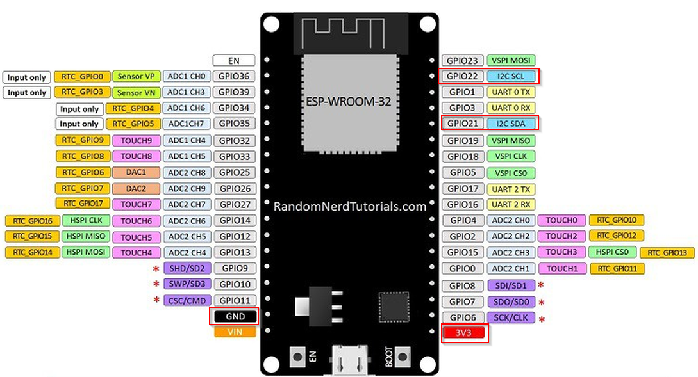

# Library Adafruit_BMP180

## Ziele

Der BMP-180 ist ein kombinierter Temperatur- und Luftdrucksensor mit I2C-Schnittstelle.
Als Basislibrary wird eine entsprechende Adafruit-Bibliothek verwendet.
Diese Library verwendet den Standard I2C-Port und kann nicht konfiguriert werden.

## Hardware

Es wird ein ESP32 und ein BMP-180 Sensor benötigt.

### Beschaltung



## Software

### Testprogramm

```c
/*
 * Rui Santos 
 * Complete Project Details http://randomnerdtutorials.com
*/

#include <Wire.h>
#include <Adafruit_BMP085.h>

Adafruit_BMP085 bmp;
  
void setup() {
  Serial.begin(115200);
  Serial.println(F("Test des Barometersensors BMP-085"));
  Serial.println(F("================================="));  
  if (!bmp.begin()) {
	Serial.println("Could not find a valid BMP085/BMP180 sensor, check wiring!");
	while (1) {}
  }
}
  
void loop() {
  Serial.print("Temperature = ");
  Serial.print(bmp.readTemperature());
  Serial.println(" *C");
    
  Serial.print("Pressure = ");
  Serial.print(bmp.readPressure());
  Serial.println(" Pa");
    
  // Calculate altitude assuming 'standard' barometric
  // pressure of 1013.25 millibar = 101325 Pascal
  Serial.print("Altitude = ");
  Serial.print(bmp.readAltitude());
  Serial.println(" meters");

  Serial.print("Pressure at sealevel (calculated) = ");
  Serial.print(bmp.readSealevelPressure());
  Serial.println(" Pa");

  // you can get a more precise measurement of altitude
  // if you know the current sea level pressure which will
  // vary with weather and such. If it is 1015 millibars
  // that is equal to 101500 Pascals.
  Serial.print("Real altitude = ");
  Serial.print(bmp.readAltitude(102000));
  Serial.println(" meters");
    
  Serial.println();
  delay(3000);
}
```

#### Musterausgabe

````
Temperature = 23.00 *C
Pressure = 98461 Pa
Altitude = 240.88 meters
Pressure at sealevel (calculated) = 98454 Pa
Real altitude = 296.56 meters
````

