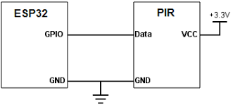

# Library PIR

## Ziele

Der ESP soll mit Hilfe dieser Library und einem PIR-Sensor feststellen können, ob sich in der Umgebung sich etwas bewegt.
Es ist ein Intervall einstellbar, wo während des Intervalls mitgezählt wird wie oft eine Bewegung stattfindet, diese wird am Ende jedes Intervalls per Mqtt weitergegeben.
Die Karenzzeit zwischen zwei Bewegungserkennungen ist einstellbar.
Diese Libary ist von der Libary Sensor abhängig.

## Hardware

Es wird lediglich ein ESP32 und ein PIR Sensor benötigt.

### Anschluss



## Software

### Test

```c
#include <PIR.h>


int Txpin = 19;
int Rxpin = 18;
//<<<<<<<<<<<<<<<<<<<<<<<

void setup() {
	Serial.begin(115200);                 //Initialisierung der seriellen Schnittstelle
	Serial.println();
	Serial.println();
	Serial.println(F("*TT ThingTest fuer Sensoren und Aktoren"));
	Serial.println(F("*TT =================================="));
	ThingConfig.readConfig();			// Einlesen der Konfiguration in den JSON-Cache
	HttpServer.init();					// HttpServer initialisieren
	ThingTime.setNtpTimeSubscriber();   // Zeit über Internet synchronisieren	
	const char* thingName = ThingConfig.getValue("ESP");
	Thing.init(thingName, true);		// Thing initialisieren	mit JSON als Messageformat     
	
	// >>>>>>>>>>>>>>>>>>>>>>  Thingspezifischer Teil
  Sensor* pirPtr = new PIR(18,30,"esp","PIR","",0);
  Thing.addSensor(pirPtr);
	//<<<<<<<<<<<<<<<<<<<<<<< Ende Thingspezifischer Teil
	UdpLoggerTarget* udpLoggerTarget = new UdpLoggerTarget("udplogger", 0);
  	Logger.addLoggerTarget(udpLoggerTarget);
	MqttClient.subscribeToBroker();
}

void loop() {
	HttpServer.handleClient();
	MqttClient.doLoop();					// Mqtt-Schnittstelle bedienen
	Thing.refreshSensorsAndActors();
	delay(1);
}

```

### Erklärung

* ```PIR(int pin, int interval, const char *thingName, const char *name, const char *unit, float threshold)``` Über Konstruktor wird der Pin und die Intervallzeit für den endlichen Automaten festgelegt

### Library

|Methode| Erklärung |
|-|-|
|```	PIR(int pin,, const char *nodeName, const char *name, const char *unit, float threshold)```| Setzt den Pin und die Karenzzeit für den PIR Sensor. |
|```float getMotion()``` | Gibt zurück, ob in der Umgebung eine Bewegung erkannt wurde |
|```virtual void measure()``` | Ruft die Methoden getMotion, dannach wir mittels einem Switch ein endlicher Automat gestartet bzw. gestoppt. Am Ende jedes Intervalls wir setMeasurement aufgerufen.|
