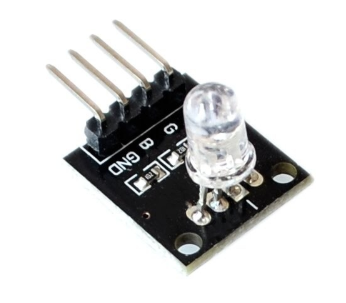

# Library RgbLed

## Ziele

Die RgbLed ist ein Aktor zur Signalisierung von Zuständen des Gerätes. Dazu stehen die drei Grundfarben Rot, Grün und Blau und auch beliebige Mischfarben zur Verfügung.
Der Aktor wird über einen Floatvalue angesteuert, der die Helligkeit für Rot, Grün und Blau so übermittelt werden, dass die Einer/Zehnerstelle Blau in %, die Hunderter/Tausenderstelle Grün und die Zehntausender/Hunderttausenderstelle Rot in Prozent angibt. 
Zur einfacheren Verwendung der Grundfarben sind die Konstanten RGB_RED,RGB_GREEN, RGB_BLUE und RGB_OFF in der Datei RgbLed.h definiert.


## Hardware

Es wird ein ESP32 und eine RGB-Led benötigt. Die drei Leds (R,G,B) werden über drei der 16 verfügbaren PWM-Kanäle angesteuert. Damit ist auch ein Dimmen oder Faden möglich (https://randomnerdtutorials.com/esp32-pwm-arduino-ide/ ).

### Beschaltung



Die Pins R, G und B werden mit beliebigen IO-Pins verbunden, die dann PWM-Kanälen zugeordnet werden.

## Software

### RgbLed.h

````c
#include <Actor.h>

#define RGB_RED  99*100*100
#define RGB_GREEN  99*100
#define RGB_BLUE  99
#define RGB_OFF  0

/*
	RgbLed ist ein Aktor, dem über einen Floatvalue die Helligkeit für Rot, Grün und
	Blau so übermittelt werden, dass die Einer/Zehnerstelle Blau in %, die Hunderter/Tausenderstelle Grün
	und die Zehntausender/Hunderttausenderstelle Rot in Prozent angibt
*/
class RgbLed : public Actor
{
  public:
	RgbLed(const int pinR, const int pinG, const int pinB, const char *thingName, const char *name);

	virtual void setActorTo(float value);

	virtual float readStateFromActor();

  private:
	int _pinR;
	int _pinG;
	int _pinB;
	int _ledChannelR = 1;
	int _ledChannelG = 2;
	int _ledChannelB = 3;
	float _value;
};

````

### Testprogramm

```c
#include <RgbLed.h>

#define R 0
#define G 2
#define B 15

/****************************************** Statische Variablen **************************************/

RgbLed rgbLed(R, G, B, "RgbThing", "Test");

/****************************************** Setup **************************************/

void setup()
{
	Serial.begin(115200); //Initialisierung der seriellen Schnittstelle
	Serial.println();
	Serial.println("RgbLedTest");
	Serial.println("==========");
	Serial.println();
}

/****************************************** Loop **************************************/

void loop()
{
	float color = RGB_RED;
	Serial.println("Rot");
	rgbLed.setActorTo(color);
	delay(2000);
	color = RGB_GREEN;
	Serial.println("Grün");
	rgbLed.setActorTo(color);
	delay(2000);
	color = RGB_BLUE;
	Serial.println("Blau");
	rgbLed.setActorTo(color);
	delay(2000);
	color = 0;
	Serial.println("Aus");
	rgbLed.setActorTo(color);
	delay(2000);
	color = 10 * 10 * 100 + 10 * 100 + 10;
	Serial.println("Rot/Grün/Blau dunkel");
	rgbLed.setActorTo(color);
	delay(2000);
	color = 99 * 100 * 100 + 99 * 100;
	Serial.println("Rot/Grün");
	rgbLed.setActorTo(color);
	delay(2000);
}
```

